# DH110 Assignment 06: Interface Design System by Haryn Shin
## Description of project
The current project "Bondily" aims to enhance the connections among family members by providing a shared journaling space where they can comfortably share their life, thoughts, and emotional experiences with each other through journaling. Through such shared, collaborative journaling app, family members can form their own private journaling space and interact with each other in a deeper level.

In this interface design process, I converted one of the low fidelity screens into a high fidelity screen, testing out different design schemes and selecting the design that best suits the project in terms of accessibility and the app's value propositions. Thus, the purpose of the interface design is to derive a design scheme for the app that thoroughly follows the design principles but also best demonstrates the functionalities and the features I aim to present through my app project. 

In terms of thee interface design process, I primarily used Figma to come up with different variations of the "Feeds" tab of my app, where users can mainly view family members' recent journal entries. With Figma, I made different variations in terms of typography, shapes and colors to test which design schemes could best serve the purpose of the shared, collaborative family journaling app. The dimensions of the screen frame I used was the standard Iphone 14 screen. For typographic variations, I made use of Google Fonts and the Figma plugin _Better Font Picker_ to test out different fonts, and for shapes and colors respectively, I adjusted the roundness of the element boxes as well as tested out different color schemes. The Screen design section that follows below details the information about the variations as well as the visuals. 

## Screen design
>Please find my complete interface design Figma file at this link: [Interface Design Figma file](https://www.figma.com/file/4twDn9DJpKNgK0MMNSx9Yk/dh110-assignment-6?type=design&node-id=0%3A1&t=4YT8UTI12ZmR2NCn-1)

### Layout
>Grid 12px; 4 Columns; Stretch; Margin 24; Gutter 18

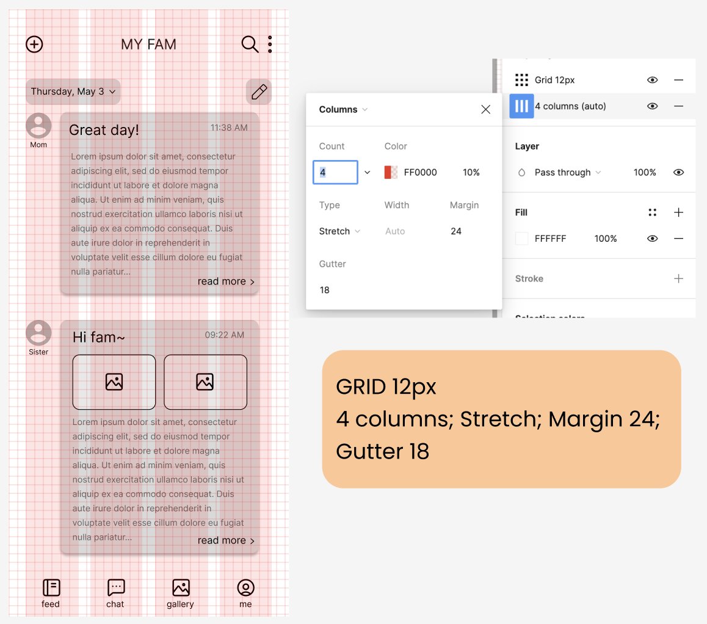

### Typographic variations
>KEPT DESIGN SCHEME: Variation 3

### Shape variations
>KEPT DESIGN SCHEME: Date button variation 3 / Icon buttons variation 3 / Entry box variation 2 (all 10px roundness, filled with no outline)

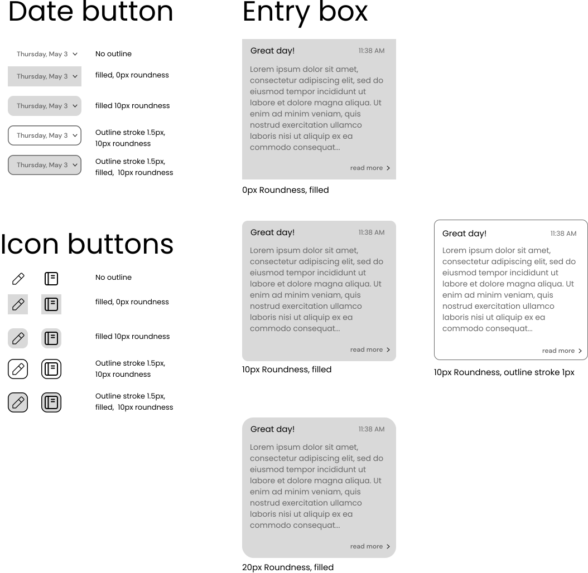

### Color variations
>KEPT DESIGN SCHEME: VARIATION 3

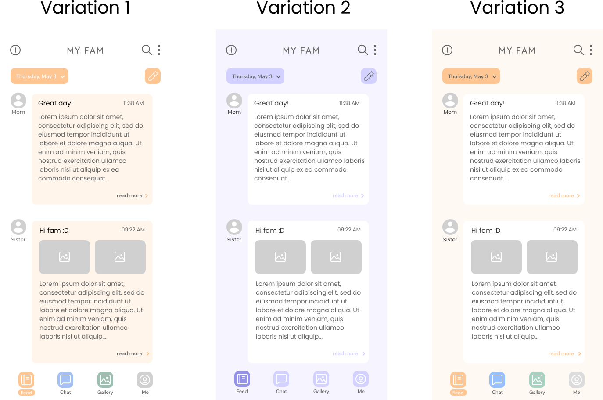

## Accessibility (color-contrast) check
### Text color contrast check 
First, I used the Figma plugin _A11y - Color Contrast Checker_ to check the color accessibility for the text contents on the screen. Initially, there were quite a few errors so I adjusted the text colors of the texts to a darker color than I had for the previous design. After adjusting some lightness details as such, I was able to fix all the errors and meet the AAA color contrast requirements.

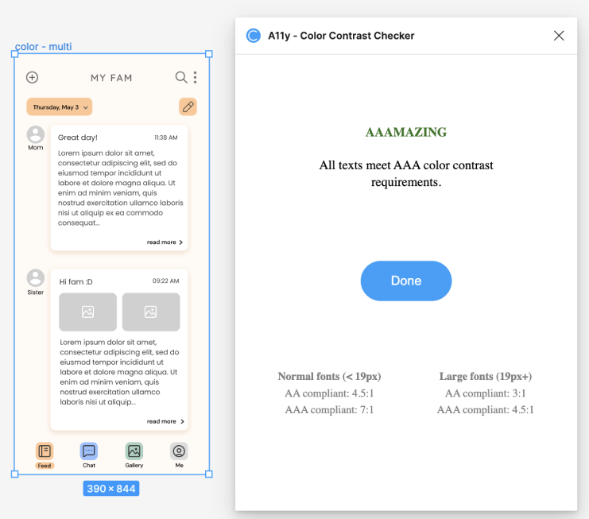

### Element color contrast check
Then, I moved on to test the color contrast for different elements or components of my screen with text. I used the FIgma plugin _Stark_ to check for the colors of these different elements. 

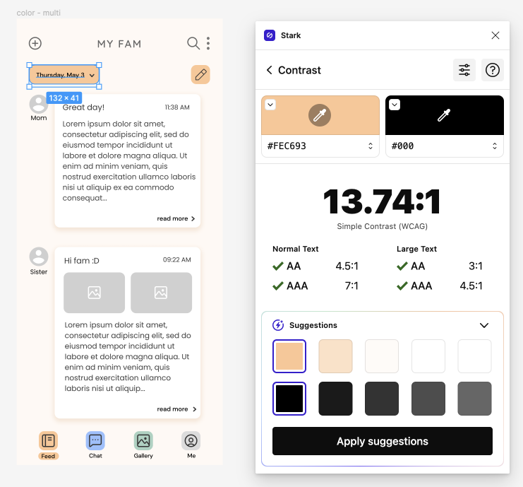
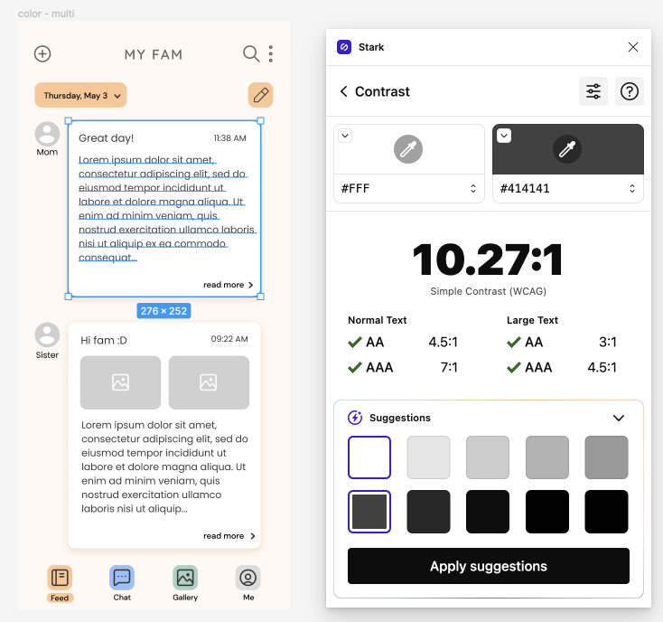
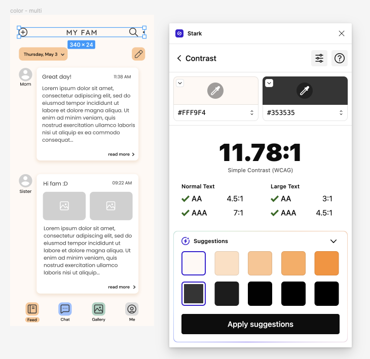

### Darkmode color contrast check
Similarily, I conducted a color contrast check on the dark mode version of the screen:

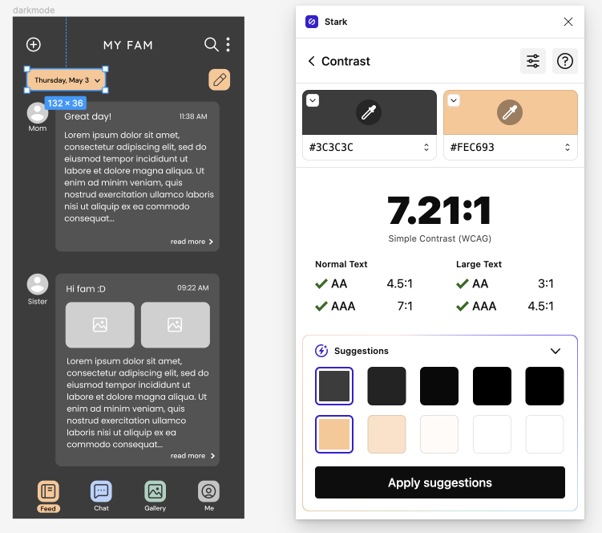
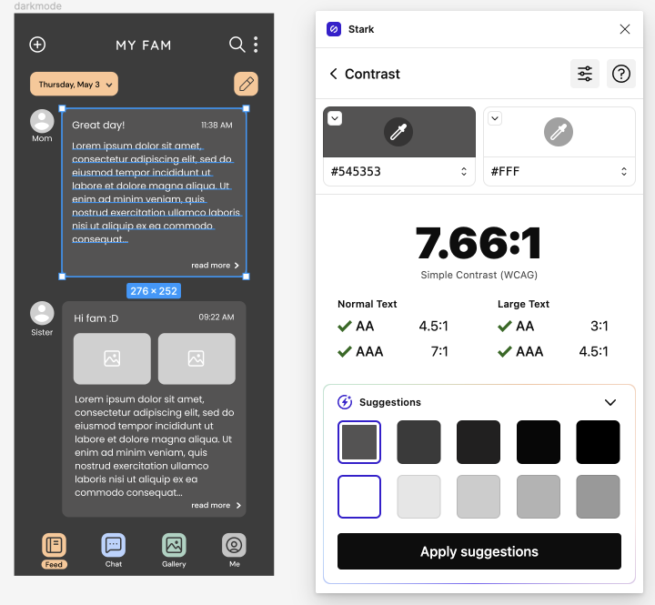
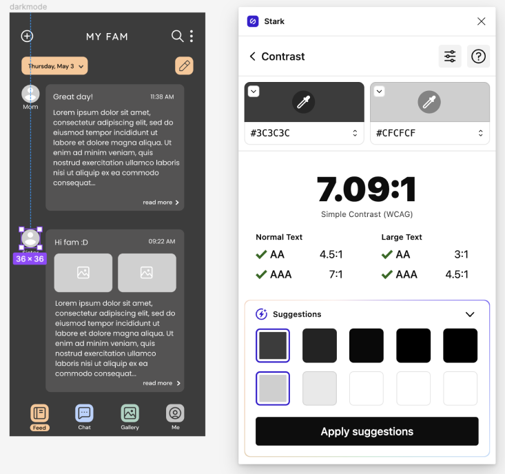

## Initial final interface (before impression test) : Light mode & Dark mode
Here are the intial final interface screens before the impression test for both light mode and dark mode of the screens. On these final screens, before moving on to the impression test, I added more specific context on the journal entries rather than using dummy texts (Lorum ipsum) in order to give a more realistic feel and prevent the impression test user from potentially getting confused by the meaningless dummy texts that I used when testing out different variations of the screen. 

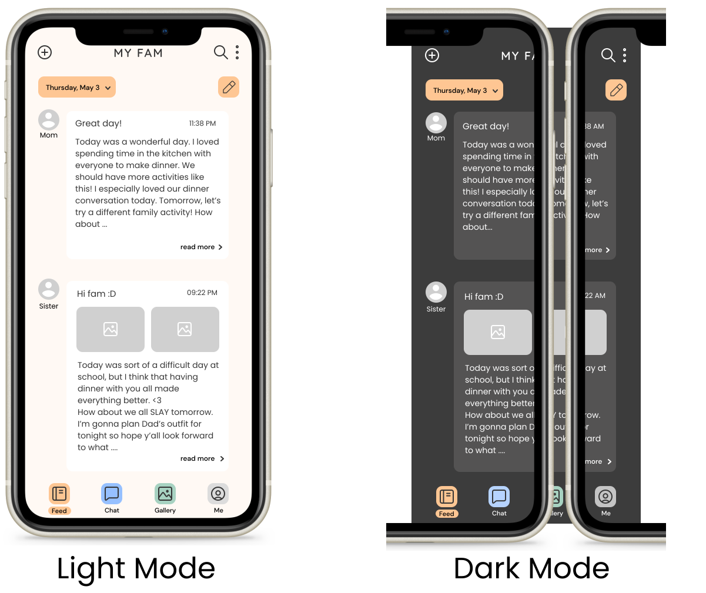

## Impression test
Please find the audio recording of the complete impression test at this link: [Impression test audio recording](https://drive.google.com/file/d/1x_ea6fDCZLwngMJR7GtbX_Zw-opnc665/view?usp=sharing)
Please find the trascript of the complete impression test at this link: [Impression test transcript](https://drive.google.com/file/d/129cVBV48B3ODtsOsWZCRpTqGhdZwc_Yp/view?usp=sharing)

### Summary of findings
#### Pros
- The color scheme is nice, giving a soft and soothing impression of the app which well matches a relaxing nature of a journaling app.
  > I really like the color scheme, or like, kind of it's very soft and warm, so it's more inviting, and it's soothing (0:34)
- The design is aesthetic and simple, and the font is very readable.
  > Design is also very aesthetic and simple. I like the font. It seems like a Sans font, and it's very readable. And it's also very  aesthetic and cohesive with the general theme of the app (1:19)
- The menu bar icons are clear as to what they would lead the user to.
  > I also like the menu bar, I really like the icons and how they're very clear on where they are going to lead me to (1:01)
- The darkmode screen looks accessible, while also carrying the original color scheme and not losing the identity of the app.
  > I really liked the dark mode I feel like it makes it more accessible especially like if I were to use this application at night, it would definitely be easier on my eyes if I was texting and my typing on my phone in the dark (4:06)

  > I like how you still kept the colors for "Feed", "Chat", and "Gallery" because it still like shows the general color scheme identity of the app. And I feel like if you were to change the colors too then it would kind of, not destroy but like really alter the color scheme of the app so I like how you kept that (4:06)
- The user was able to correctly point to what each features and functions is supposed to do on the screen.

#### Cons/ sources of improvement
- The journal entry text is too small and text-heavy considering that the feed shows the previews of the full journal entries. The date text on the date button is also too small.
  > I feel like the entry text might be too small. And it shows a lot of the entry, considering that it's just a preview. So I guess one thing that could be improved would be to make it more concise and the text to be bigger, if it's just going to be a preview (1:58)

  > Since this is a journaling app, and you're going to be having a lot of entries per day, or just having a lot of entries in general, I might want to go look at an entry written on a specific date. So I feel like it'll be helpful if the date is a little bigger, so it's more readable and I could clearly see what entries I wrote on each day (2:38)

Taking these insights into consideration, I revised my original screens to create a more accomodating design of the screen, especially in terms of the sizing of the text content. 

## Design System
### Final Interfaces
Below are the revised final interfaces based on the results of the impression test. Although only minor changes were made regarding the text sizes and spacings, it looks more clear, concise, and better to look at as the texts are less cluttered and and more readable than the previous screens. 

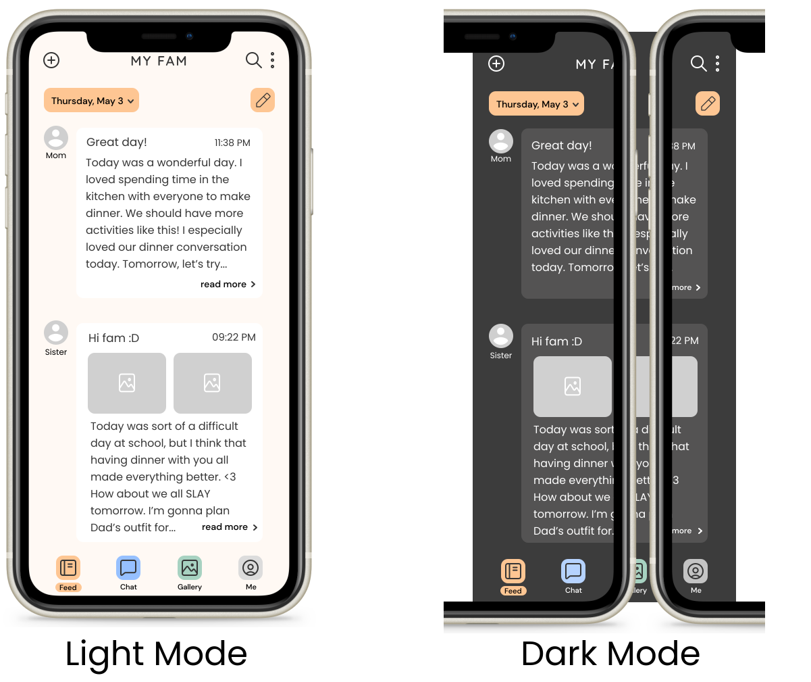

### Typeface family & size
### Color scheme
- Background: 
- Primary (default text): 
- Focus (ex. button): 

### Layout grid & spacing

