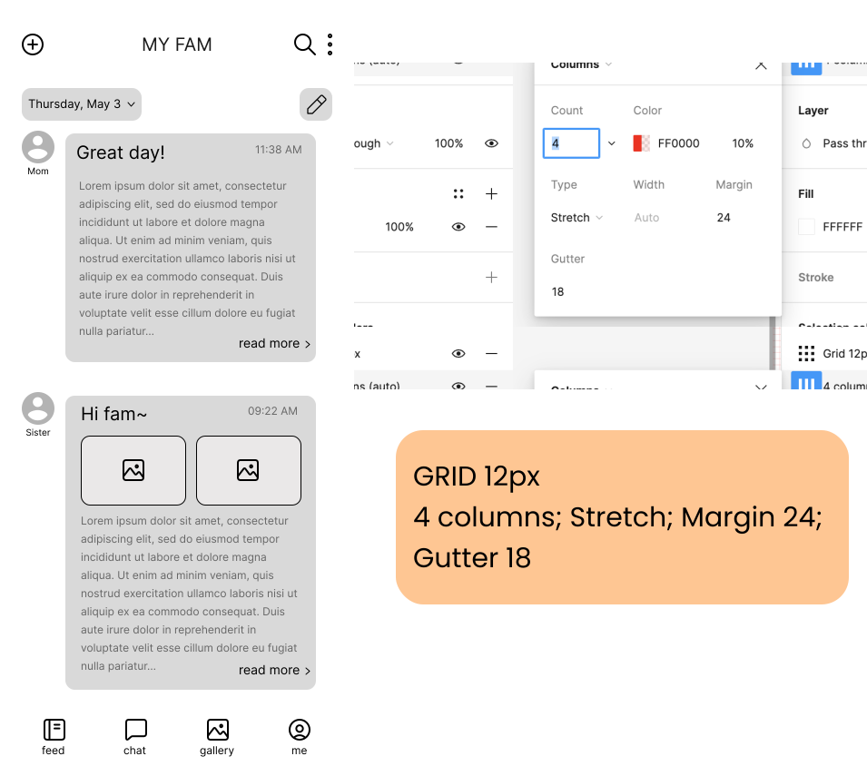

# DH110 Assignment 06: Interface Design System by Haryn Shin
## Description of project
The current project aims to enhance the connections among family members by providing a shared journaling space where they can comfortably share their life, thoughts, and emotional experiences with each other through journaling. Through such shared, collaborative journaling app, family members can form their own private journaling space and interact with each other in a deeper level.

## Screen design
### Layout

### Typography

### Shape variations

### Color variations

## Accessibility (color-contrast) check
### Text color contrast check 
First, I used the Figma plug in A11y - Color Contrast Checker to check the color accessibility for the text content on the screen. Initially, there were quite a few errors so I had to adjust the colors of the texts to a darker color than I had for the previous design. After adjusting some lightness details as such, I was able to fix all the errors and meet the AAA color contrast requirements

### Element color contrast check

## Final interface: Light mode & Dark mode

## Impression test
## Design System

