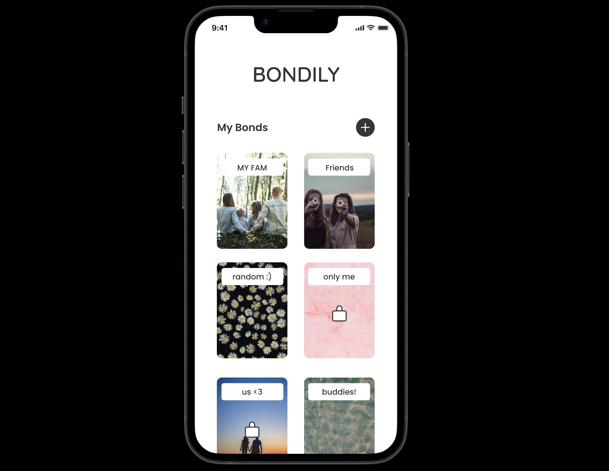

# DH110 Assignment 7: High Fidelity Prototype by Haryn Shin
## Introduction
### Project Description
The current project "Bondily" aims to enhance the connections among family members by providing a shared journaling space where they can comfortably share their life, thoughts, and emotional experiences with each other through journaling. Through such shared, collaborative journaling app, family members can form their own private journaling space and interact with each other in a deeper level.

### Overview of Interactive Prototype
#### Final Interactive Prototype 
_Click on the preview image below to access the complete High Fidelity Prototype in a new tab._

#### Purpose and Process of the Interactive Prototype
The purpose of this interactive prototype is to test out the functionality of the various components, features, and aspects of the screens. Being a high fidelity interactive prototype, this closely demonstrates what the end product would look like as well as how the user will be navigating through different aspects of the app. 

The process of constructing the interactive prototype involved the following stages: 
  1) Designing the high fidelity versions of all screens needed
  2) Deriving lists of tasks that the prototype would support, 
  3) Prototyping by connecting each screen with one another based on the task orders
  4) conducting a round of prototype testing with a real user, gathering feedback and analyzing insights
  5) Revising the current prototype with accordance to user feedback and issues that were discovered during the the prototype testing. 

## Tasks
The following lists the tasks that are supported by my interactive prototypes. These tasks are mostly based on the tasks that were presented for [Low Fidelity Prototype](https://github.com/harynshin/DH110-HARYNSHIN/blob/main/Assignments/A5_lowfi_prototype.md), with a few changes to match the updates that I have made since. 

- Task 1: Invite a member to your “My Fam” shared journal by copying the unique journal link 
- Task 2: Enter “My Fam”, write a journal entry and upload 3 photos from your photo album to the journal entry 
  - Task order: Write title --> Select mood rating --> Add 3 photos from the “Favorites album” --> Write content --> Post
- Task 3: Search for journal entries that contain the word "Vacations"
- Task 4: Find pictures that “Mom” posted from the Gallery tab, and save the first photo to your camera roll

## Wireframes & Wireflows
The following breaks down the wireframes and wireflows for each task. 
### Task 1

### Task 2

### Task 3

### Task 4

Here is the full Prototype flow for all screens, and the corresponding Figma file can be found at this link: [Hifi Prototype Figma file](https://www.figma.com/file/4twDn9DJpKNgK0MMNSx9Yk/DH110-PROJECT?type=design&node-id=49%3A244&t=K4U9TsbapQpZIMps-1)

## Interactive Prototype
- Please find the Google forms I used for the prototype testing at this link: [Bondily Prototype Testing Form](https://forms.gle/Rzit5nMrEh4oNDuj9)
- > Note: Dr. Cho, please find the editor view of this Google form at [this link](https://docs.google.com/forms/d/1yCw6OvopC0dpA8YePValcfhZxSwqdwUbBZc0S7pqs-g/edit)
- Please find the full interactive prototype  used for all tasks at this link: [Hifi Interactive Prototype link](https://www.figma.com/proto/4twDn9DJpKNgK0MMNSx9Yk/DH110-PROJECT?type=design&node-id=49-898&scaling=scale-down&page-id=49%3A244&starting-point-node-id=49%3A898&show-proto-sidebar=1)

## Prototype Testing: Cognitive Walkthrough
Please find the prototype testing video at this link: [Hifi Prototype Testing Video](https://drive.google.com/file/d/1LQV23WYDLlAtmLXnBI3KohMIcef806T7/view?usp=sharing)

In the process of prototype testing, I aimed to assess the following 4 questions that are ought to be asked during a cognitive walkthrough, laid by [this article](https://www.interaction-design.org/literature/article/how-to-conduct-a-cognitive-walkthrough):
  1) Were the user able to try and achieve the right outcome?
  2) Were the user able to notice that the correct action is available to them?
  3) Were the user able to associate the correct action with the outcome they expect to achieve?
  4) If the correct action is performed, were the user able to see that progress is being made towards their intended outcome?

For each of the user tasks, I directly asked the user about these questions, assessing if they were able to complete the tasks without much challenges, and if there were challenges, what issues they came across while navigating through the interactive prototype.  

### Summary of Findings
My participant user was able to complete all of the tasks with relative ease, and if anything, challenges came from the unfamiliarity with how Figma prototypes work; the participant was confused on how to navigate through specific sections of the prototype because it prevented them from clicking certain buttons or tabs, and some of the responses are pre-selected or pre-written for the sake of the prototype. Aside from this functional limitation of the prototype itself, the participant provided me with some good insights for each task during the process of the prototype testing.
- Task 1: The participant was able to complete this task without any difficulty, which suggests that the prototype is clear as to how to invite or add a member to a specific journal.
- Task 2: The participant had some difficulty in completing the task since they weren't very familiar with how the prototype works (for example, the blue highlights show them where they click on), but other than the functional difficulty, the particpant was able to understand the process of writing a journal entry in the app, and was able to complete the task thoroughly. Though there are some limitations as to the working of the prototype system, I realized that I should make the prototype as smooth as possible with many ways to retrieve back to the previous screens in case the user makes mistakes, which was one of the feedback that the participant provided. 
- Task 3: The participant mentioned that this task was the easiest to complete, which suggests that the prototype is clear as to how to search for keywords in the journal. 
- Task 4: Though the participant was able to achieve the expected outcome at the end, the participant showed some struggles in getting to the correct outcome. The participant first tried going to the Gallery tab, but thought that they would not be able to see the expected outcome of finding photos posted by "Mom", and retrieved back to the Feed tab and tried clicking on the user "Mom" from the feed tab. After realizing that such action did not lead to anything, they then tried clicking on the Gallery tab again, found and tried clicking on the the "Sort by" button, and successfully found their way through completing the task of finding the gallery album for the specific user "Mom". The participant was able to complete the "save the photo to camera roll" with great ease, which suggests that the save icon is clear as to what functions it serves. Nevertheless, given the challenges they faced during the first part of getting to access "Mom"'s photos, I realized that the way to complete the task should be more clear and there should also be an option in which users can access the specific user's photos by clicking on the specific user's profile icon from the Feed, thereby allowing multiple ways for users to achieve this goal of accessing photos posted by a particular user.

## Revised High Fidelity Prototype
Based on insights and feedback gathered by the prototype testing above, I revised the prototype to account for more user freedom in performing certain tasks, better alignments, and fix minor design details. The major changes are 1) allowing users to click on a specific member's profile icon to access their photos on the Gallery page, 2) A new pop-up screen that pops up after user clicks on the back arrow key when in the process of writing a journal entry that asks "Save as draft?" to avoid accidental clicks on going back and losing the journal entry that the user was workng on, as well as a new screen that displays the journal entry after user posts it, 3) connecting more elements with one another in the prototype so that though it is a prototype, the user can freely navigate through and retrieve back if an unwanted action was made, as well as adding more animation behaviors such as allowing scrolling and applying different transition behaviors for different interactions in order to resemble a realistic app and give a more natural feel.
- The final revised prototype can be found at this link: [Final Hifi Prototype](https://www.figma.com/proto/4twDn9DJpKNgK0MMNSx9Yk/DH110-PROJECT?type=design&node-id=147-22284&scaling=scale-down&page-id=147%3A22283&starting-point-node-id=147%3A22284)
- The Figma file for the revised prototype can be found at this link: [Final Hifi Figma file](https://www.figma.com/file/4twDn9DJpKNgK0MMNSx9Yk/DH110-PROJECT?type=design&node-id=147-22283&t=YxUQ5wkCxl0L7aZm-0)

